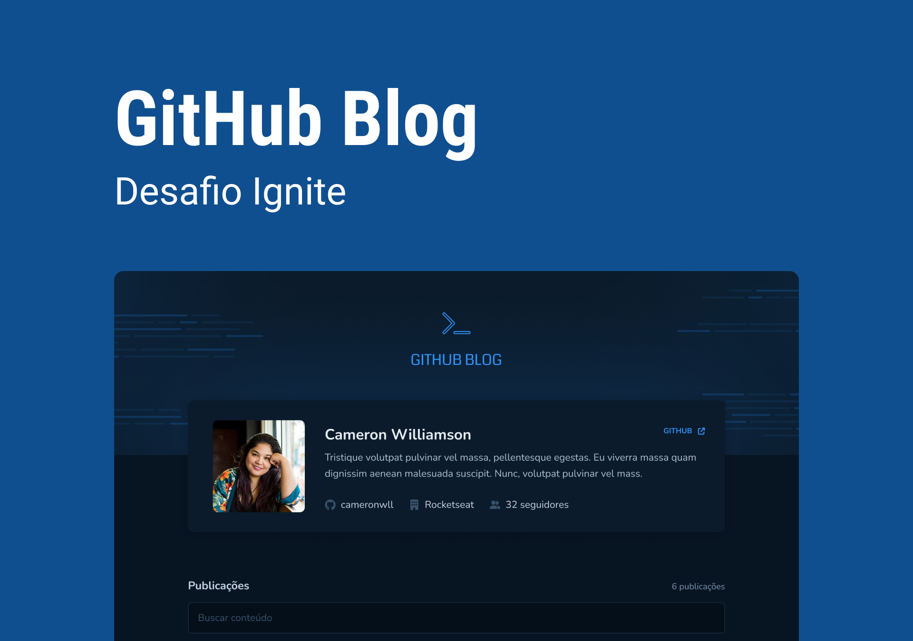
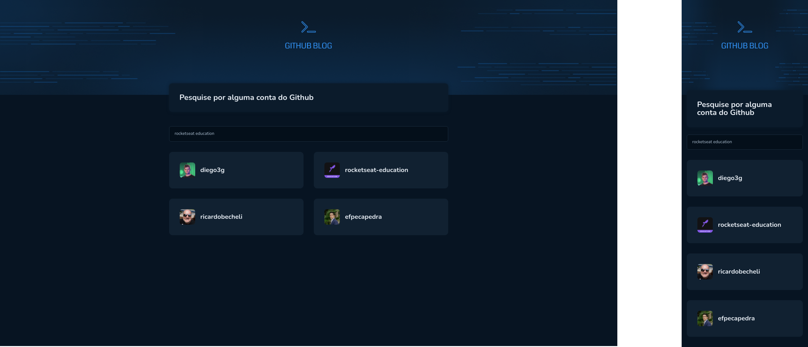
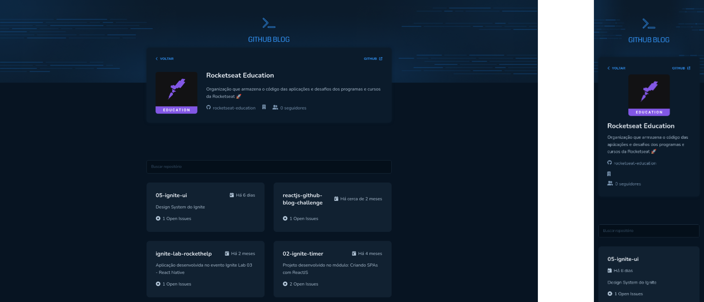
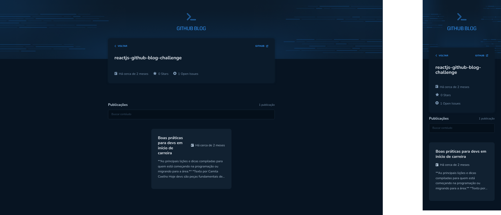
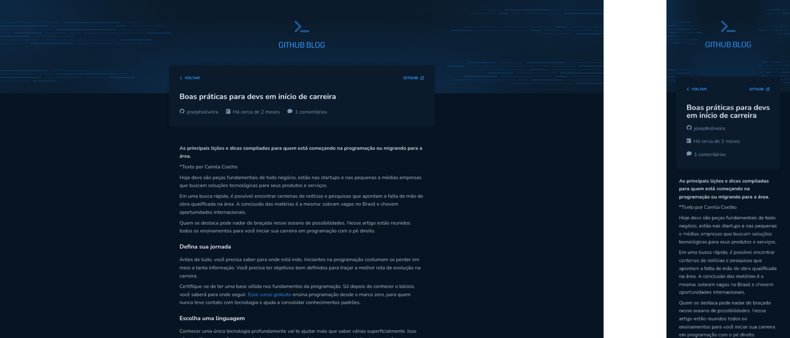

<h1 align="center">
  
</h1>

  

## ✨ Tecnologias

Esse projeto foi desenvolvido com as seguintes tecnologias:

- [Vite](https://vitejs.dev)
- [ReactJS](https://reactjs.org)
- [TypeScript](https://www.typescriptlang.org/)
- [Styled Components](https://styled-components.com)

## 🖼️ Layout

### Página Home
#### /

  

### Página User
#### /rocketseat-education

  

### Página Repository
#### /rocketseat-education/reactjs-github-blog-challenge

  

### Página Issue
#### /rocketseat-education/reactjs-github-blog-challenge/1

  

